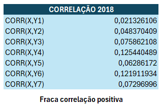

# Conhecendo os dados

O processo de exploração dos dados foi baseado na manipulação e análise de dados provenientes de duas tabelas do dataset selecionado, intituladas "INFRAESTRUTURA" e "NOTAS_DO_IDESP". A tabela "INFRAESTRUTURA", representada pela filtragem presente na Tabela 2 a seguir, continha informações sobre diversas escolas, incluindo características de infraestrutura, como categoria, subcategoria, data de cadastro, quantidade e data de atualização e a a tabela "NOTAS_DO_IDESP", demonstrada pela filtragem presente na Tabela 2 a seguir, continha dados sobre o Índice de Desenvolvimento da Educação do Estado de São Paulo (IDESP) de diferentes escolas, bem como outras informações como o ano de aplicação e a data de cadastro.

Tabela 1 - Infraestrutura das Escolas

Tabela 2 - Notas do IDESP

Inicialmente, os dados foram lidos e armazenados em estruturas de dados no VS CODE, em um programa feito em Python, utilizando a biblioteca Pandas. Em seguida, foi realizada uma filtragem e agrupamento dos dados da tabela "INFRAESTRUTURA", baseando-se, para isso, em determinadas categorias relevantes, como banheiros, cozinhas, esportes, laboratórios, leituras, outros e salas de aula. Posteriormente, as colunas foram renomeadas para facilitar a interpretação dos resultados.

Em um segundo momento, os dados das tabelas "INFRAESTRUTURA" e "NOTAS_DO_IDESP" foram mesclados com base no código da escola (COD_ESC). O resultado desse processo foi uma nova tabela contendo informações combinadas sobre infraestrutura e notas do IDESP para cada escola, contendo, inicialmente, as colunas "COD_ESC", "BANHEIROS", "COZINHA", "LABORATÓRIO","ESPORTE", "SALAS DE AULA", "LEITURA", "OUTROS", "IDESP_AI", "IDESP_AF", "DESP_EM", "ANO_APLICACAO" e "DTCADASTRO". Esse processo resultou no arquivo representado, com filtragem aplicada, pela Tabela 3 a seguir (mais detalhes do código aplicado podem ser vistos em ).

Tabela 3 - Infraestrutura das Escolas Mescladas com Notas do IDESP

Essa tabela foi dividida em três partes, correspondentes aos anos de aplicação das provas na parte do dataset selecionado, que são os anos de 2018, que teve a sua correlação de dados representada pela Tabela 4, 2019, que teve a sua correlação de dados representada pela tabela 5, e 2021, que teve a sua correlação de dados representada pela tabela 6. Foram realizados cálculos estatísticos, como mediana e correlação entre os dados, utilizando ferramentas disponíveis no Microsoft Excel.

Tabela 4 - Correlação dos dados da tabela mesclada no ano das notas do IDESP de 2018

Tabela 5 - Correlação dos dados da tabela mesclada no ano das notas do IDESP de 2019

Tabela 6 - Correlação dos dados da tabela mesclada no ano das notas do IDESP de 2021

Ainda no excel, foi feito o cálculo para análise de média, mediana e moda, para ser possível ter uma interpretação mais ampla do mapa de  calor que seria gerado posteriormente.

Tabela 7 - Média, Mediana e Moda de todos os dados de infraestrutura

Em seguida, foi gerado um mapa de calor utilizando a biblioteca Seaborn em Python, onde a correlação entre os diferentes tipos de infraestrutura e as notas do IDESP foi representada graficamente. Para essa visualização, foram removidas as colunas irrelevantes (ANO_APLICACAO, COD_ESC, IDESP_AI, IDESP_EM, DTCADASTRO) e utilizadas as informações restantes da tabela combinada. O mapa de calor proporcionou uma representação visual das relações entre os diversos aspectos da infraestrutura das escolas e o desempenho no IDESP, auxiliando na identificação de padrões e tendências nos dados analisados e é apresentado a seguir, na descrição dos achados (mais detalhes do código aplicado para gerar o mapa de calor podem ser vistos em ).

## Descrição dos achados

A análise foi realizada utilizando o mapa de calor como base após fazermos a união dos dados em um único dataset. Para isso utilizamos o python para unir a table de notas com a tabela de infraestrutura das escolas e poder analisar em um único dataset as informações que queremos cruzar.

As correlações foram medidas através do coeficiente de correlação de Pearson, que indica a força e a direção da relação linear entre duas variáveis.

Resultados e Discussão

### Infraestrutura:

O IDESP_AF não apresentou correlação significativa com a infraestrutura escolar (coeficiente de correlação de Pearson de 0,03), indicando que outros fatores, como gestão escolar, qualificação dos professores e contexto socioeconômico dos alunos, influenciam mais o desempenho das escolas.

### Cozinhas e Salas de Aula:

Similarmente, não foi detectada correlação significativa entre o IDESP_AF e a qualidade das cozinhas (coeficiente de correlação de Pearson de 0,04) e das salas de aula (coeficiente de correlação de Pearson de 0,02).

### Esportes:

Uma correlação positiva fraca (coeficiente de correlação de Pearson de 0,10) foi observada entre o IDESP_AF e a presença de infraestrutura para esportes, sugerindo que escolas com melhores resultados no IDESP_AF tendem a ter mais recursos para atividades esportivas.

### Laboratórios e Leitura:

O IDESP_AF não apresentou correlação significativa com a presença de laboratórios (coeficiente de correlação de Pearson de 0,07) ou com o incentivo à leitura (coeficiente de correlação de Pearson de 0,09).

## Ferramentas utilizadas

Para viabilizar as análises e resultados desta etapa, foi necessário o uso das seguintes ferramentas e linguagem:
* Excel - O excel foi usado para a análise inicial dos dados, cálculos de média, mediana e moda, sendo que ele também foi a ferramenta responsável pelo processamento dos cálculos isolados das correlações;
* VS Code - O VS Code foi usado para o desenvolvimento do programa responsável por unificar os dados das tabelas e por gerar o gráfico de Calor;
* Python e suas bibliotecas - A linguagem Python foi usada para permitir a implementação dos gráficos e para facilitar o processamento dos merges das tabelas.
