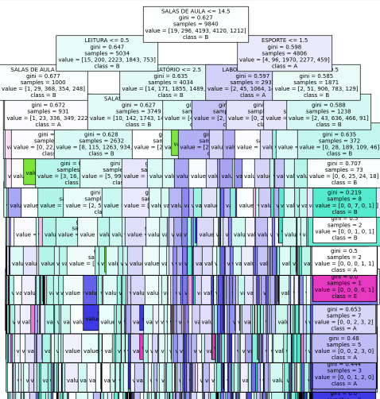
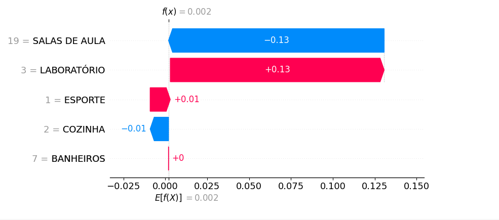
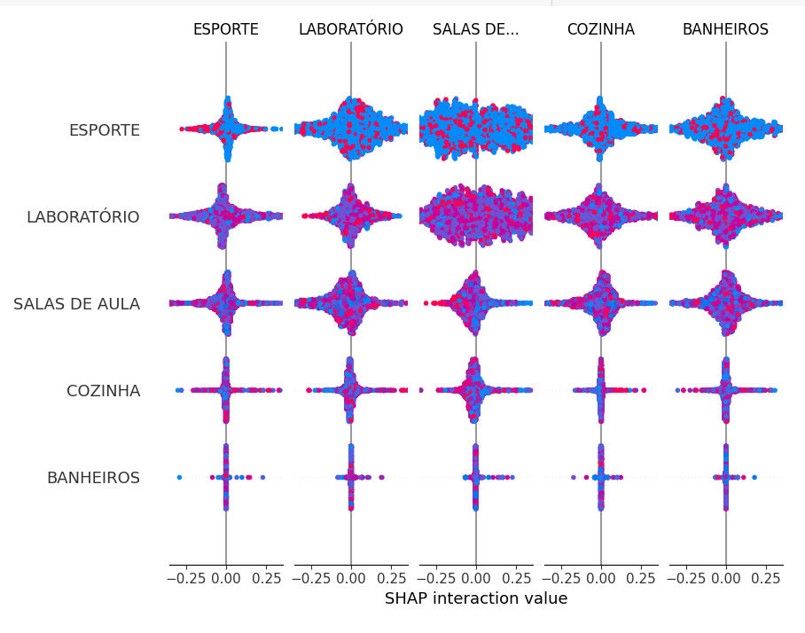
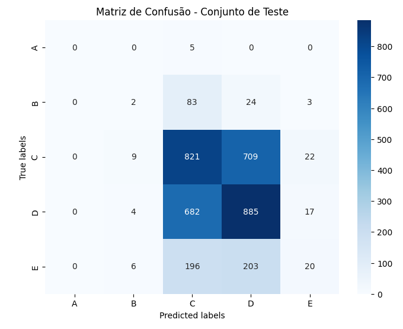
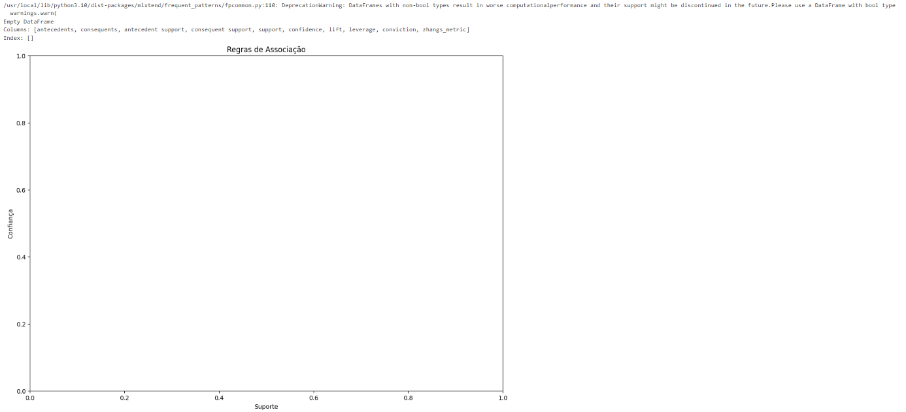

## Pergunta orientada a dados (???)

Justificar a definição / diferença da questão de pesquisa

## Tipos de dados do dataset

O dataset utilizado para construção dos modelos de aprendizado de máquina deste projeto possui os atributos descritos na tabela a seguir, que apresenta os seus respectivos tipos de dados e a descrição da informação correspondente.

|      Atributo      | Informação correspondente                                | Tipo de dado            |
| :----------------: | -------------------------------------------------------- | ----------------------- |
|     BANHEIROS      | quantidade de banheiros da escola                        | Inteiro                 |
|      COZINHA       | quantidade de cozinhas                                   | Inteiro                 |
|    LABORATORIO     | quantidade de laboratórios                               | Inteiro                 |
|      ESPORTE       | quantidade de quadras de esporte                         | Inteiro                 |
|   SALAS DE AULA    | quantidade de salas de aula                              | Inteiro                 |
|       OUTROS       | quantidade de outros itens de infraestrutura             | Inteiro                 |
|      IDESP_AF      | nota da escola para os anos finais do ensino fundamental | Valor númerico contínuo |
| CLASSIFICACAO_NOTA | classe a qual a nota da escola pertence                  | Valor categorico        |

# Preparação dos dados

Os dados utilizados no projeto foram coletados no [Portal da Transparência da educação do Governo do estado de São Paulo](https://dados.educacao.sp.gov.br/dataset/portal-da-transpar%C3%AAncia). Inicialmente, as informações da infraestrutura das escolas e as suas respectivas notas do IDESP estavam em tabelas separadas, já que o dataset disponibilizado pelo governo é composto por diversas informações sobre as escolas separadas em tabelas distintas. Devido ao enfoque dado ao projeto, referente a avaliação da nota do IDESP nos anos finais do ensino fundamental (IDESP_AF) e a influência da infraestrutura das escolas nesses resultados, foram selecionadas as tabelas das notas do IDESP e do mapeamento da infraestrutura das escolas para construção do novo dataset a ser utilizado na execução dos modelos de aprendizado de máquina e a tabela escolas foi utilizada para validação dos códigos das escolas constantes nas tabelas anteriores.

No primeiro tratamento dos dados, as categorias "BANHEIROS", "COZINHA", "LABORATÓRIO", "ESPORTE", "SALAS DE AULA", "LEITURA" e "OUTROS", que correspondiam a linhas na tabela de infraestrutura, foram separadas e transformadas em colunas com as suas respectivas quantidades por escolas para compor o novo dataset. As linhas com valores nulos para o IDESP_AF foram excluídas e também foram eliminadas as informações de datas, notas do IDESP_EM e IDESP_AI e o código da escola. O dataset resultante contemplou com a contabilização dos itens de infraestrutura e a nota IDESP_AF por escola.

Após alguns experimentos com o dataset construído inicialmente e devido às dúvidas apresentadas em aula, o grupo seguiu a orientação da Professora e realizou uma nova transformação dos dados para que as Notas IDESP_AF, que são o atributo alvo, fossem categorizadas. Por esse motivo foi adotado o método de discretização de dados por largura igual, onde foram definidas as categorias de classificação das notas de A até E, sendo A a categoria das notas mais altas e E a das notas mais baixas. Para a definição do intervalo correspondente a cada classe foram levados em consideração o valor máximo e mínimo das notas e a quantidade total de classes definidas. Como resultado, um novo dataset de nome "resultados_completos_classificados” foi criado com o acréscimo da coluna "CLASSIFICACAO_NOTA".

# Descrição dos modelos

O estudo aqui realizado apresenta a construção de modelos de aprendizado de máquina e um fluxo completo de análise destes dados obtidos. O procedimento abrange desde o consumo dos dados previamente preparados a avaliação e interpretação dos modelos escolhidos. Um conjunto de dados contendo informações sobre infraestrutura escolar e a classificação de notas associadas foi preparado, tratado e disponibilizado aos modelos para realização do estudo.
Foram utilizadas bibliotecas populares como pandas, sklearn, shap, matplotlib, seaborn e mlxtend, dentre outras. Algumas técnicas como ajuste de hiperparâmetros e uso de SHAP values, foram adotadas para explanação e mineração de dados com o algoritmo, sendo aplicadas para garantir a robustez e a interpretabilidade do modelo final.
Após todo o treino dos modelos, realizamos uma análise detalhada dos dados obtidos, ajustamos modelos preditivos e extraímos regras de associação.
Os modelos finais, após esses processos, serão apresentados a seguir.

## Modelo Classificador de Árvore de Decisão, Classificador AdaBoost e Regras de Associação

Esses modelos foram escolhidos, para o arquivo "analise_arvore.py", baseando-se no fato de que, em um muitas análises, eles são usados para tomada de decisão, como seria o fato da tomada de decisão de investir-se mais em infraestrutura das escolas, e por preverem, comumente, valores numéricos com precisão, além desses fatores, por estre projeto se tratar de um projeto vaseado em fundamentos explicados durante um semestre letivo, havia o interesse em aplicar regras já vistas nos materiais de estudo do curso.
O modelo final foi baseado nos trabalhos de Pedregosa et al. (2011), Lundberg & Lee (2017) e Agrawal, Imieliński & Swami (1993).

### Importação das bibliotecas necessárias

Inicialmente, foram importadas as bibliotecas necessárias para manipulação e análise de dados, construção de modelos preditivos, visualização e interpretação de resultados.

    import pandas as pd
    import shap
    import matplotlib.pyplot as plt
    from sklearn.metrics import accuracy_score, precision_score, recall_score, f1_score, confusion_matrix, roc_auc_score, confusion_matrix
    from sklearn.model_selection import train_test_split
    from sklearn.model_selection import cross_val_score
    from sklearn.preprocessing import LabelEncoder
    from sklearn.ensemble import AdaBoostClassifier
    from sklearn.tree import DecisionTreeClassifier
    from mlxtend.frequent_patterns import apriori, association_rules
    import seaborn as sns
    from sklearn.model_selection import GridSearchCV
    from sklearn.tree import plot_tree

### Carregamento, Visualização Inicial e preparação dos Dados:

Depois das importações, foram feitos os seguintes processos:

Carregamoento do dataset a partir de um arquivo CSV (disponibilizado no repositório) e realização das visualizações iniciais para permitir o entendimento da estrutura dos dados 'resultados_completos_classificados.csv';

Preparação dos dados para a modelagem, com a codificação da variável target CLASSIFICACAO_NOTA em valores numéricos e a separação das features (X) e da target (y).

    X = df.drop(['IDESP_AF', 'CLASSIFICACAO_NOTA'], axis=1)
    y = df['CLASSIFICACAO_NOTA']

### Divisão do Conjunto de Dados

Depois, os dados foram divididos em conjuntos de treinamento e teste, selecionando 80% dos dados para treino e 20% para teste.

    X_train, X_test, y_train, y_test = train_test_split(X, y, test_size=0.2, random_state=42)

### Construção e Avaliação do Modelo de Árvore de Decisão

Posteriormente, um modelo de Árvore de Decisão foi inicializado e treinado, avaliando-se sua acurácia.

    model = DecisionTreeClassifier(random_state=42, max_depth=5)
    model.fit(X_train, y_train)
    predictions = model.predict(X_test)
    accuracy = accuracy_score(y_test, predictions)

### Ajuste de Hiperparâmetros

Foi realuzado o ajuste de hiperparâmetros utilizando GridSearchCV para encontrar a melhor combinação de parâmetros.

    param_grid = {
        'max_depth': [5, 10, 15, 20],
        'min_samples_split': [2, 5, 10],
        'min_samples_leaf': [1, 2, 4]
    }
    grid_search = GridSearchCV(estimator=DecisionTreeClassifier(random_state=42), param_grid=param_grid, cv=5, scoring='accuracy')
    grid_search.fit(X_train, y_train)
    best_params = grid_search.best_params_

### Avaliação do Modelo Otimizado

Foi realizado o Re-treino do modelo de Árvore de Decisão com os melhores hiperparâmetros e foi reavaliada a sua acurácia.

    best_model = DecisionTreeClassifier(**best_params, random_state=42)
    best_model.fit(X_train, y_train)
    predictions = best_model.predict(X_test)
    accuracy = accuracy_score(y_test, predictions)

### Visualização e Interpretação do Modelo

Figura 8 - Árvore de Decisão

Figura 9 - Shap tipo 1

Figura 10 - Shap tipo 2

Foram feitos a Plotagem da árvore de decisão e os calculos dos SHAP values para interpretação.

    plt.figure(figsize=(10,20))
    plot_tree(best_model, feature_names=X_train.columns, class_names=y_train.unique(), filled=True, fontsize=10)
    plt.show()
    explainer = shap.TreeExplainer(best_model)
    shap_values = explainer.shap_values(X_test)
    shap.summary_plot(shap_values, X_test, plot_size=(15, 8), max_display=7)

### Cálculo de Métricas de Desempenho

Foram calculadas várias métricas de desempenho, incluindo acurácia, precisão, recall e F1 Score.

    accuracy = accuracy_score(y_test, predictions)
    precision = precision_score(y_test, predictions, average='weighted')
    recall = recall_score(y_test, predictions, average='weighted')
    f1 = f1_score(y_test, predictions, average='weighted')

### Plotagem da Matriz de Confusão (img matrizC1)

Foi plotada a matriz de confusão para avaliar o desempenho do modelo.

    plt.figure(figsize=(8, 6))
    cm = confusion_matrix(y_test, predictions)
    sns.heatmap(cm, annot=True, fmt="d", cmap="Blues", xticklabels=y_train.unique(), yticklabels=y_train.unique())
    plt.title('Matriz de Confusão - Conjunto de Teste')
    plt.show()

### Modelagem com AdaBoost

Figura 11 - Matriz

O modelo AdaBoost com uma Árvore de Decisão como base estimator e realizamos a validação cruzada foi inicializado.

    base_estimator = DecisionTreeClassifier(max_depth=1, random_state=42)
    ada_model = AdaBoostClassifier(estimator=base_estimator, n_estimators=50, random_state=42)
    ada_model.fit(X_train, y_train)
    y_pred = ada_model.predict(X_test)
    accuracy = accuracy_score(y_test, y_pred)
    precision = precision_score(y_test, y_pred, average='weighted')
    recall = recall_score(y_test, y_pred, average='weighted')
    f1 = f1_score(y_test, y_pred, average='weighted')

### Mineração de Dados com Apriori

Figura 12 - Regras

Foi aplicado, ao fim, o algoritmo Apriori para calcular itens frequentes e gerar regras de associação

    infra_cols = ['BANHEIROS', 'COZINHA', 'LABORATORIO', 'ESPORTE', 'SALAS DE AULA', 'LEITURA', 'OUTROS']
    df_bin = df[infra_cols].applymap(lambda x: 1 if x > 0 else 0)
    frequent_items = apriori(df_bin, min_support=0.1, use_colnames=True)
    rules = association_rules(frequent_items, metric="lift", min_threshold=1.0)

## Modelo de Regressão Linear Múltipla

Esse modelo foi escolhido baseando-se em análises feitas por Nepal(2016), que estipulou um bom resultado nas análises feitas entre infraestruturas de escolas e os resultados dos alunos, uma vez que, nesse estudo, ele usou a regressão múltipla para treinar o seu modelo.

O modelo final foi baseado na regressão linear múltipla proposta por Hariharan(2024), em seu código disponível na plataforma Kaggle.

### Importação das bibliotecas necessárias

Aqui, foram importandas as bibliotecas que serão usadas para manipulação de dados (Pandas e NumPy), visualização (Matplotlib e Seaborn) e machine learning (Scikit-Learn).

    import pandas as pd
    import numpy as np
    import matplotlib.pyplot as plt
    import seaborn as sns
    from sklearn.linear_model import LinearRegression
    from sklearn.model_selection import train_test_split
    from sklearn import metrics

### Carregamento do dataset

Carregou-se os dados do arquivo CSV para um DataFrame do Pandas.

    df = pd.read_csv('resultados_completos_classificados.csv')

### Visualização inicial dos dados

Aqui, o modelo criado faz, sucessivamente:

Apresentação de uma amostra aleatória de 5 linhas do DataFrame;

Contagem de número de entradas não nulas em cada coluna;

Contagem de número de valores nulos em cada coluna.

    df.sample(5)
    df.count()
    df.isna().sum()

### Substituição de valores categóricos

O modelo faz, consecutivamente:

Converte a coluna CLASSIFICACAO_NOTA de categórica para numérica, substituindo 'A', 'B', 'C', 'D', 'E' por 1, 2, 3, 4, 5, respectivamente, pois a regressão só trabalha com dados numéricos (embora depois esse dado vá ser dropado da tabela);

Ao fim, são exibidas as primeiras 5 linhas do DataFrame para uma visualização inicial.

    df["CLASSIFICACAO_NOTA"]=df["CLASSIFICACAO_NOTA"].replace(to_replace=['A', 'B', 'C', 'D', 'E'], value=[1, 2, 3, 4, 5])
    df.head()

### Visualização da distribuição dos dados

Nessa parte, para cada coluna relevante, foi plotado um histograma para visualizar a distribuição dos valores e entender melhor como os dados estavam funcionando no dataset (o que, em verdade, seguiu não sendo conclusivo).

    plt.hist(df['BANHEIROS'], bins=5)
    plt.title('Distribuição de Banheiros')
    plt.show()

    plt.hist(df['COZINHA'], bins=5)
    plt.title('Distribuição de Cozinha')
    plt.show()

    plt.hist(df['LABORATORIO'], bins=5)
    plt.title('Distribuição de Laboratórios')
    plt.show()

    plt.hist(df['ESPORTE'], bins=5)
    plt.title('Distribuição de salas de esporte')
    plt.show()

        plt.hist(df['SALAS DE AULA'], bins=5)
    plt.title('Distribuição de salas de aula')
    plt.show()

    plt.hist(df['LEITURA'], bins=5)
    plt.title('Distribuição de salas de leitura')
    plt.show()

    plt.hist(df['OUTROS'], bins=5)
    plt.title('Distribuição de salas para outros fins')
    plt.show()

    plt.hist(df['IDESP_AF'], bins=5)
    plt.title('Distribuição de notas do idesp AF')
    plt.show()

### Matriz de correlação

Aqui foram feitos, respectivamente:

O Cálculo da matriz de correlação entre as colunas;

A Plotagem de um mapa de calor da matriz de correlação para identificar visualmente a relação entre as variáveis, como já havia sido feito isso antes, a matriz de correlação seguiu não apresentando grandes correlações.

    df.corr()
    sns.heatmap(df.corr(), cmap='coolwarm', annot=True)
    plt.show()

### Correlação com a variável dependente

Nessa parte, foi realizada a ordenação dos coeficientes de correlação das variáveis independentes com a variável dependente "CLASSIFICACAO_NOTA".

    df.corr()['CLASSIFICACAO_NOTA'].sort_values()

### Divisão dos dados em variáveis independentes e dependentes

Nesse caso, os itens representam:

x - DataFrame contendo todas as colunas exceto "CLASSIFICACAO_NOTA" e "IDESP_AF";

y - Série contendo apenas a coluna "IDESP_AF".

Nota: Essa será a base para as análises e as colunas dropadas não podem estar dentro do datafame influenciando o treino, por serem os resultados que desejamos encontrar.

    x = df.drop(['CLASSIFICACAO_NOTA','IDESP_AF'], axis = 1)
    y = df['IDESP_AF']

### Divisão dos dados em conjuntos de treino e teste

Aqui, divide-se os dados em conjuntos de treino (70%) e teste (30%).

    x_train, x_test, y_train, y_test = train_test_split(x, y, test_size = 0.3, random_state = 100)

### Criação e treino do modelo de regressão linear:

Inicialmente, na seguinte parte, são feitos os processos de:

Criar uma instância do modelo de regressão linear;

Treinar o modelo usando os dados de treino.

    mlr = LinearRegression()
    mlr.fit(x_train, y_train)

### Exibição dos coeficientes do modelo:

Essa parte do código tem o objetivo de mostrar alguns coeficientes, sendo eles:

Intercept - O valor esperado da variável dependente (IDESP_AF) quando todas as variáveis independentes são zero;

Coeficientes - Representam a mudança esperada na variável dependente para uma unidade de mudança na variável independente correspondente.

    print("Intercept: ", mlr.intercept*)
    print("Coefficients:")
    list(zip(x, mlr.coef*))

### Predição nos dados de teste:

Aqui é feita a previsões usando os dados de teste.

    y_pred_mlr= mlr.predict(x_test)

### Visualização das previsões:

Essa parte é dedicada a plotagem de um gráfico de dispersão das previsões versus os valores reais nessa parte do código.

    sns.regplot(x=y_test, y=y_pred_mlr, ci=None, color='red', line_kws={"color": "black"})
    plt.show()

### Calcula e exibe as métricas de desempenho do modelo:

Aqui se mostra os dados que permitirão uma avaliação do modelo, como:

R squared - que é o ajuste do modelo aos dados que contém "mlr.score(x,y)" que indica a proporção da variância explicada pelo modelo.

Mean Absolute Error - que é a média das diferenças absolutas entre os valores previstos e os valores reais;

Mean Square Error - que é a a média das diferenças ao quadrado entre os valores previstos e os valores reais;

Root Mean Square Error - que é a raiz quadrada do MSE, proporcionando uma métrica de erro na mesma unidade da variável dependente.

    meanAbErr = metrics.mean_absolute_error(y_test, y_pred_mlr)
    meanSqErr = metrics.mean_squared_error(y_test, y_pred_mlr)
    rootMeanSqErr = np.sqrt(metrics.mean_squared_error(y_test, y_pred_mlr))
    print('R squared: {:.2f}'.format(mlr.score(x,y)\*100))
    print('Mean Absolute Error:', meanAbErr)
    print('Mean Square Error:', meanSqErr)
    print('Root Mean Square Error:', rootMeanSqErr)

### Predição com novos dados:

Nessa parte, é feita uma predição com novos dados fornecidos manualmente(usamos aqui métricas presentes na tabela de correlação entre infraestrutura e notas do Idesp_AF, para o resultado ser o mais realista comparativamente).

    Classificacao_Nota_Index= mlr.predict([[3,3,2,2,18,1,8]])
    print(Classificacao_Nota_Index)

# Avaliação dos modelos criados

## Métricas utilizadas

Nesta seção, as métricas utilizadas para avaliar os modelos desenvolvidos deverão ser apresentadas (p. ex.: acurácia, precisão, recall, F1-Score, MSE etc.). A escolha de cada métrica deverá ser justificada, pois esta escolha é essencial para avaliar de forma mais assertiva a qualidade do modelo construído.

## Discussão dos resultados obtidos

Nesta seção, discuta os resultados obtidos pelos modelos construídos, no contexto prático em que os dados se inserem, promovendo uma compreensão abrangente e aprofundada da qualidade de cada um deles. Lembre-se de relacionar os resultados obtidos ao problema identificado, a questão de pesquisa levantada e estabelecendo relação com os objetivos previamente propostos.

# Pipeline de pesquisa e análise de dados

Em pesquisa e experimentação em sistemas de informação, um pipeline de pesquisa e análise de dados refere-se a um conjunto organizado de processos e etapas que um profissional segue para realizar a coleta, preparação, análise e interpretação de dados durante a fase de pesquisa e desenvolvimento de modelos. Esse pipeline é essencial para extrair _insights_ significativos, entender a natureza dos dados e, construir modelos de aprendizado de máquina eficazes.
