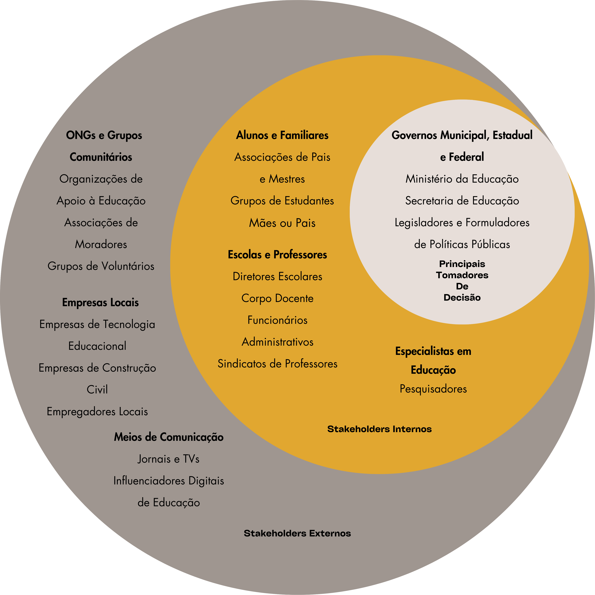

# Introdução

A Constituição Federal de 1988 estabelece a educação como um direito fundamental de todo cidadão brasileiro e, em seus artigos 205 e 214, define que o ensino visa garantir o pleno exercício da cidadania, o desenvolvimento pessoal de cada indivíduo e a condução à erradicação do analfabetismo. A Carta Magna também define, em seu artigo 206, o direito a iguais condições de acesso, permanência e manutenção de padrões de qualidade em instituições de ensino, uma vez que, se não garantidos esses pontos, o aluno pode ter sua permanência prejudicada em locais educacionais. Nesse contexto, a alfabetização e a infraestrutura das instituições se apresentam como algo fundamental para a garantia , junto ao cidadão, da educação formal e do acesso pleno aos direitos constitucionais.

Considerando essas observações e levando-se em consideração que notas de avaliações sobre a educação, como a do IDESP, podem permitir um melhor entendimento, juntamente com os dados de infraestrutura das escolas, de como a igualdade de acesso pode influenciar no desempenho dos alunos em seu processo de alfabetização, este trabalho objetiva experimentar um modelo de aprendizado que permita uma análise de como a infraestrutura pode influenciar no processo de alfabetização, garantindo o que é desejado na constituição, no que diz respeito a erradicação do analfabetismo no Brasil.

## Problema

A carência de infraestrutura nas escolas brasileiras é um desafio constante para as famílias de renda média e baixa. Devido à escassez de recursos financeiros para matricular seus filhos em escolas privadas com instalações e serviços mais eficientes, muitas dessas famílias só conseguem lançar mão do direito constitucional à educação que se materializa, majoritariamente, de forma tão precária. Isso tem consequências conhecidas há décadas, com jovens e adultos enfrentando sérias deficiências em seu processo educacional, resultando em um ônus significativo para o país. 

Essas famílias representam mais de 90% da população brasileira, o que implica diretamente no menor desempenho econômico nacional, cuja suas consequências, em parte, vinculam-se à ausência de infraestrutura nos espaços escolares. Parte desse cenário poderia ser revertido por meio de políticas mais efetivas, que destinassem e fiscalizassem recursos para aprimorar as condições educacionais, porém, aparentemente, tal iniciativa não tem sido priorizada. 

Pesquisadores de renome internacional ressaltam que uma infraestrutura escolar de qualidade e adequada à demanda escolar tem o poder de influenciar positivamente no processo de aprendizagem dos alunos e, consequentemente, na qualidade do ensino fornecido pelos professores. Observações e diagnósticos têm consistentemente demonstrado que escolas com infraestrutura precária, salas de aula superlotadas e falta de recursos básicos estão associadas a resultados acadêmicos mais baixos e taxas de desistência mais altas. 

Neste contexto, nosso estudo se concentra na análise da infraestrutura educacional do Estado de São Paulo, utilizando como métrica o IDESP, um indicador de qualidade do ensino estadual. Dentre as questões e hipóteses formuladas, destacamos as seguintes: Quais estratégias de investimento em infraestrutura física, como reforma de instalações existentes e inclusão de novos espaços, demonstram ter maior impacto na melhoria da qualidade do ensino?; O que os especialistas em educação preconizam quanto à qualidade do ensino em escolas com melhores infraestruturas é algo quantificável nos dados do IDESP?

## Questão de Pesquisa

Estudos destacam o impacto da infraestrutura escolar no rendimento dos alunos, podendo prejudicar o processo de ensino e desmotivar os estudantes. Esta pesquisa busca analisar a relação entre a qualidade da infraestrutura escolar e o desempenho na alfabetização, medido pelo IDESP. O objetivo é compreender como o ambiente escolar influencia a alfabetização, visando melhorar a qualidade da educação.

**Pergunta de Pesquisa:** Como a infraestrutura escolar influencia o desempenho dos alunos na alfabetização, de acordo com a avaliação do IDESP?

## Objetivos preliminares

### Objetivo Geral

Experimentar modelos de aprendizado de máquina adequados para apontar a influência da infraestrutura escolar no desempenho dos alunos de alfabetização, conforme avaliação do IDESP de 2023.

### Objetivos Específicos

- Verificar as notas Alfabetização do IDESP ao longo de 2023 de acordo com as instituições de ensino;
- Verificar a infraestrutura das escolas de São Paulo no período em que foram aplicadas as avaliações do IDESP de 2023;
- Identificar os modelos existentes de aprendizado de máquina que mais se aproximam do objetivo de entendimento da influência da infraestrutura escolar nas notas de alunos;
- Comparar, por meio de modelo de aprendizado de máquina selecionado, as variações das notas do IDESP conforme a variação da infraestrutura escolar.

## Justificativa

A escolha desse conjunto de dados e objetivos específicos transcorre pela necessidade de compreender melhor como a infraestrutura das escolas públicas impacta diretamente no desempenho de seus alunos, alinhando-se com os objetivos de desenvolvimento sustentável estabelecidos pela ONU, em particular, o ODS4, que visa garantir uma educação de qualidade, inclusiva e equitativa para todos.

O projeto tem como foco principal o levantamento e a analise de insumos da relação entre a infraestrutura escolar e o desempenho dos alunos. Fornecendo insights valiosos para aprimorar políticas públicas e práticas educacionais, contribuindo para a formulação de estratégias eficazes de melhoria da qualidade da educação.

O público-alvo dessa obra inclui gestores educacionais, formuladores de políticas públicas, pesquisadores da área da educação e profissionais envolvidos na gestão e manutenção da infraestrutura escolar, bem como a sociedade em geral interessada no aprimoramento do sistema educacional.

Este trabalho está baseado em dados do IDESP (Índice de Desenvolvimento da Educação do Estado de São Paulo), o qual fornece dados confiáveis e informações essenciais para embasar a análise da relação entre infraestrutura escolar e desempenho dos alunos, bem como para justificar a importância e relevância do tema abordado.

## Público-Alvo

Foi estabelecido como público-alvo os seguintes indivíduos: os alunos e seus familiares próximos; os professores e seus sindicatos de classe; os especialistas em educação; os legiladores e os formuladores de políticas públicas e as pessoas em geral interessadas no tema.

.png)
.png)
.png)
.png)

## Estado da arte

A pesquisa sobre infraestrutura escolar e qualidade do ensino, como apresentada por Sá e Werle (2017), revela-se um campo rico e promissor, embora seja pouco discutido em termos quantitativos no Brasil. Em sua análise de teses e dissertações defendidas nos programas de pós-graduação em Educação brasileiros, entre 2003 e 2013, os autores destacam a necessidade de uma maior atenção a essa temática, especialmente no que diz respeito à infraestrutura escolar. Isso ocorre porque o conjunto de trabalhos examinados aponta para lacunas significativas, como a necessidade de uma abordagem mais centrada na infraestrutura escolar, explorando suas diversas dimensões e suas relações com o currículo, o bem-estar docente e a acolhida discente. Segundo os pesquisadores, há uma urgência em ampliar a variedade de temas de pesquisa e aprofundar questões empíricas, garantindo um tratamento mais abrangente e detalhado dos aspectos físicos disponíveis nas escolas, incluindo prédios, salas de aula e equipamentos. Esse panorama evidencia a importância de expandir e aprimorar os estudos nessa área, a fim de promover um ambiente escolar mais propício ao aprendizado e ao desenvolvimento integral dos alunos. Com vistas à ampliação desse campo de estudo, nosso intuito é contribuir analiticamente para o desenvolvimento dessa linha de pesquisa e, para realizar isso adequadamente, é preciso revisar, de modo breve, o que já fora discutido em conjunto com os métodos aplicados. Nesse sentido, nesta apresentação do estado da arte dessa temática, priorizou-se publicações que abrangem o período entre 2015 e 2023 que serão discutidas nos próximos parágrafos.

O estudo de Vasconcelos et al. (2020) teve como objetivo principal identificar o impacto da infraestrutura escolar e dos investimentos públicos em Educação no desempenho educacional. Para isso, foram desenvolvidos índices específicos e utilizados modelos econômicos complexos para analisar essas relações.

Na fase de operacionalização dos indicadores, um Índice de Infraestrutura Escolar (IIE) foi construído, abrangendo quatro dimensões cruciais: infraestrutura de serviços básicos, infraestrutura física, disponibilidade de equipamentos e capacitação de discentes. Esses indicadores foram selecionados criteriosamente para refletir as condições das escolas, levando em conta aspectos como confiabilidade das fontes e facilidade de interpretação. O estudo também empregou o Índice de Desenvolvimento da Educação Básica (IDEB) como proxy para avaliar o desempenho educacional, juntamente com dados sobre despesas com Educação. O IIE foi calculado como a média aritmética dos subíndices das dimensões, variando de 0 a 1, representando a ausência e a presença total dos indicadores, respectivamente. Para o indicador de desempenho educacional, foi adotado o Índice de Desenvolvimento da Educação Básica (IDEB) do município, com base em dados de escolas públicas. O IDEB combina a pontuação média dos alunos em exames padronizados e a taxa média de aprovação. O estudo utilizou valores médios de anos específicos para mitigar possíveis viéses nos dados.

A análise econômica foi conduzida por meio de regressões quantílicas, permitindo investigar os efeitos das variáveis independentes em diferentes pontos da distribuição da variável dependente. Esse método permite estimativas para diferentes quantis da distribuição da variável dependente, possibilitando captar efeitos diferenciados nos extremos da distribuição. Os resultados revelaram que a melhoria da infraestrutura escolar influencia positivamente a qualidade da Educação, evidenciando a importância dos investimentos públicos nesse setor. No entanto, apesar de avanços percebidos entre 2007 e 2017, ainda persistem lacunas na implementação de itens essenciais para o pleno funcionamento das escolas, contribuindo para um cenário desigual entre elas.

O estudo também destacou a relação diferenciada entre os investimentos públicos em Educação e a infraestrutura escolar, dependendo do nível de desenvolvimento inicial das escolas (path-dependence). Notou-se que as escolas com menor infraestrutura tendem a responder de forma mais significativa aos recursos investidos, ressaltando a importância de uma alocação eficiente de recursos para reduzir as desigualdades educacionais.

Em suma, os resultados sugerem que não apenas o esforço individual dos alunos, mas também o ambiente escolar e os investimentos públicos, desempenham um papel fundamental no desempenho educacional. Assim, é essencial que as políticas públicas priorizem não apenas o aumento dos investimentos, mas também a garantia de uma infraestrutura escolar adequada e a gestão eficiente desses recursos, visando promover uma Educação mais equitativa e de qualidade em todo o país.

Já o estudo de Gil-Flores, Rodríguez-Santero e Torres-Gordillo (2017), publicado na Espanha, forneceu uma análise secundária baseada em dados obtidos na Pesquisa Internacional sobre Ensino e Aprendizagem (TALIS) de 2013, conduzido pela OCDE, tendo em vista o uso das Tecnologias da Informação e da Comunicação (TICs) no ambiente escolar. O objetivo dos pesquisadores era obter parâmetros por meio de indicadores internacionais e análises sobre professores e educação para promover melhorias no ensino e na aprendizagem. Eles utilizaram dados de amostras representativas de professores em 34 países, incluindo a Espanha, e realizaram análises estatísticas complexas para investigar a relação entre o uso de tecnologias de informação e comunicação (TICs) na sala de aula e variáveis como características demográficas dos professores e infraestrutura de TICs nas escolas.

Os pesquisadores consideraram como espaço amostral os professores do ensino secundário obrigatório (Nível ISCED-2 na Classificação Internacional Padrão de Educação) que participaram do TALIS de 2013. Tal amostra consistiu em 3339 professores de 192 escolas. No caso da Espanha, o método usado para a seleção foi a amostragem aleatória estratificada nas 18 comunidades autônomas do país. Em cada comunidade, um certo número de escolas foi selecionado em proporção ao tamanho de cada estrato. Os professores foram escolhidos aleatoriamente dentro das 192 escolas selecionadas durante a segunda etapa de amostragem.

Quanto às variáveis, verificamos que aquela de natureza dependente se vincula ao uso de TICs na sala de aula. A informação foi fornecida pelos professores, que indicaram a frequência com que seus alunos usavam TICs para concluir projetos ou trabalhos de classe. Quanto às variáveis independentes, o primeiro grupo inclui as características demográficas dos professores: gênero do professor (masculino ou feminino), idade e experiência de ensino (número de anos). Um segundo grupo de variáveis fornece informações sobre a infraestrutura de TICs nos centros de educação: computadores para instrução, acesso à internet e software para instrução. Essas três variáveis, medidas para cada escola, correspondem a outros itens nos questionários respondidos pelos diretores das escolas. Por fim, o terceiro grupo de variáveis corresponde a características dos professores relacionadas às necessidades de formação, conceitos e desempenho de ensino.

Os dados foram analisados utilizando modelos de regressão logística multinível para analisar a relação entre as variáveis independentes e o uso de TICs na sala de aula. Considerando que os professores estão inseridos em escolas, as respostas dos professores de uma mesma escola não são independentes entre si, pois esses professores estão inseridos no mesmo contexto escolar. Portanto, foi utilizado um modelo multinível para conduzir uma única análise com variáveis medidas no nível do professor (Nível 1) e no nível da escola (Nível 2). O modelo inclui efeitos fixos para variáveis explicativas e interceptos aleatórios para diferenciar escolas. Razões de probabilidade foram calculadas para determinar o impacto das variáveis explicativas na probabilidade de uso frequente de TICs nas salas de aula. Além disso, quatro modelos de regressão foram construídos para abordar diferentes questões de pesquisa, cada um ajustando para variáveis específicas relacionadas às características dos professores e à infraestrutura de TICs. Parâmetros foram estimados usando a estimativa de verossimilhança, e testes de significância foram conduzidos usando o teste qui-quadrado de Wald.

Além desses estudos, Ramos, Cristian e Príncipe (2015) revisaram os conceitos de Big Data e Data Warehouse, aplicando-os ao contexto educacional brasileiro. Eles descreveram o processo de construção de um Data Warehouse para armazenar e analisar dados do Instituto Nacional de Estudos e Pesquisas Educacionais Anísio Teixeira (INEP) e discutiram a importância da análise de dados para entender a qualidade da educação no país. Todo o processo de extração, transformação e carga (ETL) foi realizado por meio do desenvolvimento de scripts em SQL (Structured Query Language). Para importar a tabela no Microsoft SQL Server 2008, foi necessário transformá-la, remover a formatação, excluir células mescladas, substituir caracteres e modificar os nomes das colunas. Em seguida, os dados foram importados para o banco de dados EDC_ODS, que atua como armazenamento de dados operacionais.

Posteriormente, foi necessário desenvolver o modelo de dados a ser utilizado e, para isso, inicialmente se sugeriu responder às quatro perguntas a seguir: O que será avaliado?; Como será avaliado ou analisado?; Qual é o menor nível de detalhe?; Como espera-se resumir essas informações?. O modelo utilizado foi o esquema estrela, que pode ser descrito pela inclusão de tabelas centrais chamadas de tabelas de fatos, compostas por entidades transacionais. As tabelas de dimensão foram criadas a partir de cada entidade componente que congregam entidades de avaliação. Tanto o modelo quanto as tabelas foram criados no banco de dados EDUC_BI. Após a criação do modelo, iniciou-se o desenvolvimento de scripts SQL para extrair, transformar e carregar dados no modelo multidimensional. Esse procedimento é realizado selecionando os dados de destino, adaptando-os quando necessário e inserindo-os no modelo de destino. As entidades transacionais serão conectadas às entidades componentes e classificadas por meio de uma classificação entre elas, permitindo a navegação por atributos de maneira otimizada. Para permitir essas conexões, todos os atributos numéricos nas tabelas de fatos que não são considerados métricas devem ser agregados em uma chave primária e vinculados às suas dimensões. Após todos os dados serem devidamente carregados, eles serão acessados diretamente pela ferramenta IBM SPSS via conexão ODBC e realizarão mineração de dados e análise estatística.

O objetivo da classificação não supervisionada ou agrupamento é determinar uma estrutura de grupos que se ajuste aos dados disponíveis, ou seja, classificar objetos de acordo com o agrupamento natural dos próprios dados. Nesse caso, pouco ou nada se sabe sobre a estrutura ou os grupos e nem o número de grupos é conhecido. A estrutura deve reunir objetos com características semelhantes no mesmo grupo, o que implica que o grau de associação é alto entre os membros da mesma classe e baixo entre elementos de categorias diferentes. Os clusters devem apresentar homogeneidade interna e heterogeneidade externa. A ideia é encontrar uma partição de N objetos em um número de K clusters que atendam às premissas básicas: coesão interna e isolamento dos clusters.

O segundo passo considera subgrupos resultantes do primeiro passo como entrada e, em seguida, agrupa-os no número desejado de clusters. Como o número de subgrupos é muito menor que o número de registros originais, é possível usar métodos de agrupamento tradicionais de forma eficaz. Após a construção do banco de dados, começa o momento da análise de dados para entender como estão as escolas do país e fazer avaliações de possíveis discrepâncias apresentadas nas notas do IDEB e características dos grupos. A construção dos grupos foi feita usando análise de cluster, porque criou grupos com características semelhantes e, em seguida, análises específicas serão feitas em cada grupo. O banco de dados foi construído com todas as 159.909 escolas que foram avaliadas nos anos de 2007, 2009, 2011 e 2013, quando houve uma distribuição muito semelhante em termos de escolas avaliadas para os quatro anos.

Este estudo teve como objetivo organizar dados de diferentes fontes, adicionando-os em um único banco de dados por meio de um Data Warehouse para tornar viável a análise, a fim de entender a avaliação da educação básica na perspectiva do Revisor Estadual como um mecanismo que gera informações sobre pontos positivos e fracos de uma escola ou sistema educacional para fornecer melhorias. Em relação à quantidade de dados das bases, concluiu-se que a melhor abordagem seria reduzir o número de escolas em pequenos clusters e facilitar análises e estratégias mais direcionadas, como identificar o grupo com menor renda, como o segmento 4, composto por estados com menor investimento em educação e PIB per capita muito baixo, enquanto os dois principais segmentos são compostos pelos estados de São Paulo e Minas Gerais, que têm grande investimento na área e lideram o país em PIB per capita.

Por último, o estudo de Swarna Prava Hota (2023) buscou compreender duas dimensões: o investimento em educação e o crescimento econômico regional. Utilizando dados secundários relacionados ao número de escolas, às taxas de matrícula, às instalações infraestruturais, às despesas com educação e ao Produto Interno Bruto (PIB) do Estado de Odisha, na Índia, de 2005 a 2021, obtidos do Ministério da Educação, da Diretoria de Educação para Todos e do Governo de Odisha, o principal objetivo da pesquisa era determinar se existia uma relação entre despesas em educação e o crescimento do produto interno bruto, conforme afirmado: "Existe uma relação significativa entre a Despesa com Educação e a Matrícula Bruta (GER) com o crescimento do Produto Interno Bruto Estadual Bruto (GSDP)?" (SWARNA PRAVA HOTA, 2023, p. 2). O método de pesquisa empregado envolveu desde simples cálculos estatísticos até análises de tendências, regressões e distribuições normais. Como resultado, os pesquisadores identificaram que sua hipótese sobre a correlação entre investimento e crescimento estava correta, uma vez que os investimentos em educação impactaram positivamente no crescimento do PIB da região de Odisha.

Esses estudos, portanto, contribuem significativamente para o entendimento da relação entre infraestrutura escolar, investimentos em educação e qualidade do ensino, fornecendo insights importantes para formuladores de políticas, pesquisadores e profissionais da área educacional.

# Descrição do _dataset_ selecionado

### Dataset: Portal da Transparência da Educação do Governo do Estado de São Paulo

### Link : [Portal da Transparência da educação do Governo do estado de São Paulo](https://dados.educacao.sp.gov.br/dataset/portal-da-transpar%C3%AAncia)

### Origem dos Dados

O dataset selecionado foi obtido a partir do Portal da Transparência da Educação do Governo do Estado de São Paulo, que é uma uma plataforma que disponibiliza diversos dados públicos sobre a Educação no estado.

### Conteúdo do Dataset
O dataset contém diversas tabelas com informações variadas, tais como o sobre desempenho acadêmico, escolas, professores, destinação orçamentária e outras mais.

### Formato de Dados
Os dados das tabelas são relacionados conforme o que é visto em bancos dados relacionais, ou seja, contam com chaves estrangeiras que permitem os seus relacionamentos.

Em um contexto geral, cada tabela é a representação de uma entidade, ou conjunto de dados específicos, e cada coluna de uma tabela representa um atributo da sua entidade relacionada.

### Atributos
Dentre as tabelas consideradas na análise deste projeto, as selecionadas são as de "Infraestrutura", "NOTAS_DO_IDESP" e "Escolas" (todas elas estão presentes em pastas de nomes "Mapa de escolas por diretoria" em cada período de avaliação).
#### Tabela "ESCOLAS"
Nessa tabela, serão assumidos os dados filtrados para escolas estaduais. O atribudo seleciobnado é:

CODESC - Um inteiro que representa o Código da escola.

#### Tabela "INFRAESTRUTURA"
Nessa tabela, serão assumidos os dados filtrados para escolas estaduais no período de realização das avaliações do IDESP. Os atributos selecionados são:

CATEGORIA - Uma string de área de aplicação do ambiente;

SUBCATEGORIA - Uma string que define especificidade da infraestrutura;

QTD - Um inteiro que define a quantidade de itens, de uma determinada infraestrutura, que existem na escola.

#### Tabela "NOTAS_DO_IDESP"
Nessa tabela, serão assumidos os dados filtrados de escolas estaduais. O atributo selecionado é:

IDESP_AF - Um decimal que define a nota, por escola, de alfabetização (um valor que pode variar de 0 a 10).

# Canvas analítico

# Referências
CENTRO DE REFERÊNCIAS EM EDUCAÇÃO INTEGRAL. Infraestrutura influencia qualidade da educação. Disponível em: <https://educacaointegral.org.br/reportagens/infraestrutura-influencia-qualidade-da-educacao/>. Acesso em: 06 de mar. de 2024.

CONSTITUIÇÃO DA REPÚBLICA FEDERATIVA DO BRASIL de 1988. Brasília, DF: Presidência da República. Disponível em: <https://www.planalto.gov.br/ccivil_03/constituicao/constituicao.htm>. Acesso em: 08 de mar. de 2024.

GIL-FLORES, J.; RODRÍGUEZ-SANTERO, J.; TORRES-GORDILLO, J. J. Factors that explain the use of ICT in secondary-education classrooms: The role of teacher characteristics and school infrastructure. Computers in Human Behavior, v. 68, p. 441-449, 2017. ISSN 0747-5632. Disponível em: <https://doi.org/10.1016/j.chb.2016.11.057>. Acesso em: 10 de mar. de 2024.

GOVERNO DO ESTADO DE SÃO PAULO. Dados Educacionais - Instalações físicas por unidade escolar. Disponível em: <https://dados.educacao.sp.gov.br/dataset/instala%C3%A7%C3%B5es-f%C3%ADsicas-por-unidade-escolar>. Acesso em: 06 de mar. de 2024.

GOVERNO DO ESTADO DE SÃO PAULO. Dados Educacionais - Portal da Transparência. Disponível em: <https://dados.educacao.sp.gov.br/dataset/portal-da-transpar%C3%AAncia>. Acesso em: 06 de mar. de 2024.

GOVERNO DO ESTADO DE SÃO PAULO. IDESP - Índice de Desenvolvimento da Educação do Estado de São Paulo. Disponível em: <http://idesp.edunet.sp.gov.br/>. Acesso em: 06 de mar. de 2024.

HOTA, Swarna Prava. Education infrastructure, expenditure, enrollment & economic development in Odisha, India. International Journal of Educational Development, v. 103, p. 102903, 2023. ISSN 0738-0593. Disponível em: <https://doi.org/10.1016/j.ijedudev.2023.102903>. Acesso em: 10 de mar. de 2024.

NAÇÕES UNIDAS. ODS 4 - Educação de qualidade. Disponível em: <https://brasil.un.org/pt-br/sdgs/4>. Acesso em: 06 de mar. de 2024.

RAMOS, Thiago Graca; MACHADO, Jean Cristian Ferreira; CORDEIRO, Bruna Principe Vieira. Primary Education Evaluation in Brazil Using Big Data and Cluster Analysis. Procedia Computer Science, v. 55, p. 1031-1039, 2015. ISSN 1877-0509. Disponível em: <https://doi.org/10.1016/j.procs.2015.07.061>. Acesso em: 10 mar. 2024.

SÁ, J. dos S.; WERLE, F. O. C.. Infraestrutura escolar e espaço físico em educação: o estado da arte. Cadernos De Pesquisa, v. 47, n. 164, p. 386–413, 2017. Disponível em: <https://doi.org/10.1590/198053143735>. Acesso em: 10 de mar. de 2024.

VASCONCELOS, Joyciane Coelho et al. Infraestrutura escolar e investimentos públicos em Educação no Brasil: a importância para o desempenho educacional. Ensaio: aval. pol. públ. educ., Rio de Janeiro, v. 29, n. 113, p. 874-898, out. 2021. Disponível em: <http://educa.fcc.org.br/scielo.php?script=sci_arttext&pid=S0104-40362021000400874&lng=pt&nrm=iso>. Acesso em: 10 mar. 2024.

