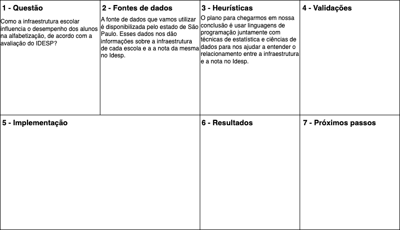

# Introdução

A Constituição Federal de 1988 estabelece a educação como um direito fundamental de todo cidadão brasileiro desde sua promulgação. Segundo o artigo 205 da Carta Magna, a educação visa garantir o pleno exercício da cidadania e o desenvolvimento pessoal do indivíduo. Nesse contexto, a alfabetização desempenha um papel central no cenário educacional, capacitando o indivíduo a compreender os processos e o mundo ao seu redor, o que o torna mais engajado socialmente e consciente de seus direitos e deveres.

A nota do IDESP (Índice de Desenvolvimento da Educação do Estado de São Paulo) de Alfabetização é um indicador crucial do desempenho das políticas educacionais no estado de São Paulo e reflete o compromisso das autoridades educacionais com a promoção da alfabetização, isso porque ela oferece uma melhor compreensão sobre os desafios e os progressos na área da educação, demonstrando o empenho dedicado para garantir o acesso pleno à educação e o efetivo papel do cidadão na sociedade.

Além disso, o texto constitucional, em seu artigo 206, estipula um padrão de qualidade educacional e condições de igualdade para a permanência do cidadão na escola. Nesse sentido, a infraestrutura escolar desempenha um papel crucial, influenciando diretamente na qualidade do ensino oferecido e no ambiente propício ao aprendizado. Uma infraestrutura adequada não só proporciona condições para o desenvolvimento educacional, mas também contribui para promover a igualdade de oportunidades e efetivar o direito à educação de qualidade para todos os cidadãos.

Considerando essas observações, esse trabalho tem como objetivo realizar comparações entre as notas do IDESP de alfabetização e a infraestrutura das escolas com foco em fornecer uma contextualização da real influência da infraestrutura educacional no desempenho do aluno na nota do IDESP de Alfabetização, destacando, assim, para instituições de ensino e pessoas ligadas a área de infraestrutura de ambientes educacionais, a relevância das escolhas realizadas nesse âmbito para o desempenho dos alunos.

Texto descritivo introdutório apresentando a visão geral do projeto a ser desenvolvido considerando o contexto em que ele se insere, os objetivos gerais, a justificativa e o público-alvo do projeto.

## Problema

A carência de infraestrutura nas escolas brasileiras é um desafio constante para as famílias de renda média e baixa. Devido à escassez de recursos financeiros para matricular seus filhos em escolas privadas com instalações e serviços mais eficientes, muitas dessas famílias só conseguem lançar mão do direito constitucional à educação que se materializa, majoritariamente, de forma tão precária. Isso tem consequências conhecidas há décadas, com jovens e adultos enfrentando sérias deficiências em seu processo educacional, resultando em um ônus significativo para o país. 

Essas famílias representam mais de 90% da população brasileira, o que implica diretamente no menor desempenho econômico nacional, cuja suas consequências, em parte, vinculam-se à ausência de infraestrutura nos espaços escolares. Parte desse cenário poderia ser revertido por meio de políticas mais efetivas, que destinassem e fiscalizassem recursos para aprimorar as condições educacionais, porém, aparentemente, tal iniciativa não tem sido priorizada. 

Pesquisadores de renome internacional ressaltam que uma infraestrutura escolar de qualidade e adequada à demanda escolar tem o poder de influenciar positivamente no processo de aprendizagem dos alunos e, consequentemente, na qualidade do ensino fornecido pelos professores. Observações e diagnósticos têm consistentemente demonstrado que escolas com infraestrutura precária, salas de aula superlotadas e falta de recursos básicos estão associadas a resultados acadêmicos mais baixos e taxas de desistência mais altas. 

Neste contexto, nosso estudo se concentra na análise da infraestrutura educacional do Estado de São Paulo, utilizando como métrica o IDESP, um indicador de qualidade do ensino estadual. Dentre as questões e hipóteses formuladas, destacamos as seguintes: Quais estratégias de investimento em infraestrutura física, como reforma de instalações existentes e inclusão de novos espaços, demonstram ter maior impacto na melhoria da qualidade do ensino?; O que os especialistas em educação preconizam quanto à qualidade do ensino em escolas com melhores infraestruturas é algo quantificável nos dados do IDESP?

## Questão de Pesquisa

Estudos destacam o impacto da infraestrutura escolar no rendimento dos alunos, podendo prejudicar o processo de ensino e desmotivar os estudantes. Esta pesquisa busca analisar a relação entre a qualidade da infraestrutura escolar e o desempenho na alfabetização, medido pelo IDESP. O objetivo é compreender como o ambiente escolar influencia a alfabetização, visando melhorar a qualidade da educação.

**Pergunta de Pesquisa:** Como a infraestrutura escolar influencia o desempenho dos alunos na alfabetização, de acordo com a avaliação do IDESP?

## Objetivos preliminares

Aqui você deve descrever os objetivos preliminares do trabalho indicando que o objetivo geral é experimentar modelos de aprendizado de máquina adequados para solucionar o problema apresentado acima.

Apresente também alguns (pelo menos 2) objetivos específicos dependendo de onde você vai querer concentrar a sua prática investigativa, ou como você vai aprofundar no seu trabalho.

Por exemplo: um objetivo específico pode estar relacionado a predizer a tendência de alta, estabilidade ou queda de uma determinada ação em uma determinada janela do tempo ou então, predizer o valor exato de uma determinada ação.
Lembre-se que, à medida que a pesquisa/experimentação evolui, os objetivos podem evoluir também, portanto, não se esqueça de fazer as atualizações necessárias.

> **Links Úteis**:
>
> - [Objetivo geral e objetivo específico: como fazer e quais verbos utilizar](https://blog.mettzer.com/diferenca-entre-objetivo-geral-e-objetivo-especifico/)

## Justificativa

A escolha desse conjunto de dados e objetivos específicos transcorre pela necessidade de compreender melhor como a infraestrutura das escolas públicas, impacta diretamente no desempenho de seus alunos, alinhando-se com os objetivos de desenvolvimento sustentável estabelecidos pela ONU, em particular, o ODS4, que visa garantir uma educação de qualidade, inclusiva e equitativa para todos.

O projeto tem como foco principal o levantamento e a analise de insumos da relação entre a infraestrutura escolar e o desempenho dos alunos. Fornecendo insights valiosos para aprimorar políticas públicas e práticas educacionais, contribuindo para a formulação de estratégias eficazes de melhoria da qualidade da educação.

O público-alvo dessa obra inclui gestores educacionais, formuladores de políticas públicas, pesquisadores da área da educação e profissionais envolvidos na gestão e manutenção da infraestrutura escolar, bem como a sociedade em geral interessada no aprimoramento do sistema educacional.

Este trabalho está baseado em dados do IDESP (Índice de Desenvolvimento da Educação do Estado de São Paulo), o qual fornece dados confiáveis e informações essenciais para embasar a análise da relação entre infraestrutura escolar e desempenho dos alunos, bem como para justificar a importância e relevância do tema abordado.

> **Links Úteis**:
>
> - [Como montar a justificativa](https://guiadamonografia.com.br/como-montar-justificativa-do-tcc/)

## Público-Alvo

Descreva quem serão as pessoas que poderão se beneficiar com a sua investigação indicando os diferentes perfis. O objetivo aqui não é definir quem serão os clientes ou quais serão os papéis dos usuários na aplicação. A ideia é, dentro do possível, conhecer um pouco mais sobre o perfil dos usuários: conhecimentos prévios, relação com a tecnologia, relações hierárquicas, etc.

Adicione informações sobre o público-alvo por meio de uma descrição textual, diagramas de personas e mapa de stakeholders.

> **Links Úteis**:
>
> - [Público-alvo](https://blog.hotmart.com/pt-br/publico-alvo/)
> - [Como definir o público alvo](https://exame.com/pme/5-dicas-essenciais-para-definir-o-publico-alvo-do-seu-negocio/)
> - [Público-alvo: o que é, tipos, como definir seu público e exemplos](https://klickpages.com.br/blog/publico-alvo-o-que-e/)
> - [Qual a diferença entre público-alvo e persona?](https://rockcontent.com/blog/diferenca-publico-alvo-e-persona/)

## Estado da arte

Nesta seção, deverão ser descritas outras abordagens identificadas na literatura que foram utilizadas para resolver problemas similares ao problema em questão. Para isso, faça uma pesquisa detalhada e identifique, no mínimo, 3 trabalhos que tenham utilizado dados em contexto similares e então, detalhe: detalhe e contextualize o problema, descreva o _dataset_ utilizado, detalhe quais abordagens/algoritmos foram utilizados (e seus parâmetros), identifique as métricas de avaliação empregadas e fale sobre os resultados obtidos.

> **Links Úteis**:
>
> - [Google Scholar](https://scholar.google.com/)
> - [IEEE Xplore](https://ieeexplore.ieee.org/Xplore/home.jsp)
> - [Science Direct](https://www.sciencedirect.com/)
> - [ACM Digital Library](https://dl.acm.org/)

# Descrição do _dataset_ selecionado

Nesta seção, você deverá descrever detalhadamente o _dataset_ selecionado. Lembre-se de informar o link de acesso a ele, bem como, de descrever cada um dos seus atributos (a que se refere, tipo etc.), se existem atributos faltantes etc.

# Canvas analítico

> **Links Úteis**:
>
> - [Modelo do Canvas Analítico](https://github.com/ICEI-PUC-Minas-PMV-SI/PesquisaExperimentacao-Template/blob/main/help/Software-Analtics-Canvas-v1.0.pdf)

# Referências
Centro de Referências em Educação Integral: Infraestrutura influencia qualidade da educação. Disponível em: <https://educacaointegral.org.br/reportagens/infraestrutura-influencia-qualidade-da-educacao/>. Acesso em: 06 de mar. de 2024.

Governo do Estado de São Paulo: Dados Educacionais - Instalações físicas por unidade escolar. Disponível em: <https://dados.educacao.sp.gov.br/dataset/instala%C3%A7%C3%B5es-f%C3%ADsicas-por-unidade-escolar>. Acesso em: 06 de mar. de 2024.

Governo do Estado de São Paulo: Dados Educacionais - Portal da Transparência. Disponível em: <https://dados.educacao.sp.gov.br/dataset/portal-da-transpar%C3%AAncia>. Acesso em: 06 de mar. de 2024.

Governo do Estado de São Paulo: IDESP - Índice de Desenvolvimento da Educação do Estado de São Paulo. Disponível em: <http://idesp.edunet.sp.gov.br/>. Acesso em: 06 de mar. de 2024.

NAÇÕES UNIDAS: ODS 4 - Educação de qualidade. Disponível em: <https://brasil.un.org/pt-br/sdgs/4>. Acesso em: [06 de mar. de 2024].

Secretaria da Educação do Estado de São Paulo: IDESP - Índice de Desenvolvimento da Educação do Estado de São Paulo. Disponível em: <https://www.educacao.sp.gov.br/idesp>. Acesso em: 06 de mar. de 2024.

Centro de Referências em Educação Integral: Infraestrutura influencia qualidade da educação. Disponível em: <https://educacaointegral.org.br/reportagens/infraestrutura-influencia-qualidade-da-educacao/>. Acesso em: 06 de mar. de 2024.

Governo do Estado de São Paulo: Dados Educacionais - Instalações físicas por unidade escolar. Disponível em: <https://dados.educacao.sp.gov.br/dataset/instala%C3%A7%C3%B5es-f%C3%ADsicas-por-unidade-escolar>. Acesso em: 06 de mar. de 2024.

Governo do Estado de São Paulo: Dados Educacionais - Portal da Transparência. Disponível em: <https://dados.educacao.sp.gov.br/dataset/portal-da-transpar%C3%AAncia>. Acesso em: 06 de mar. de 2024.

Governo do Estado de São Paulo: IDESP - Índice de Desenvolvimento da Educação do Estado de São Paulo. Disponível em: <http://idesp.edunet.sp.gov.br/>. Acesso em: 06 de mar. de 2024.

NAÇÕES UNIDAS: ODS 4 - Educação de qualidade. Disponível em: <https://brasil.un.org/pt-br/sdgs/4>. Acesso em: [06 de mar. de 2024].

Secretaria da Educação do Estado de São Paulo: IDESP - Índice de Desenvolvimento da Educação do Estado de São Paulo. Disponível em: <https://www.educacao.sp.gov.br/idesp>. Acesso em: 06 de mar. de 2024.

Inclua todas as referências (livros, artigos, sites, etc) utilizados no desenvolvimento do trabalho utilizando o padrão ABNT.

> **Links Úteis**:
>
> - [Padrão ABNT PUC Minas](https://portal.pucminas.br/biblioteca/index_padrao.php?pagina=5886)
